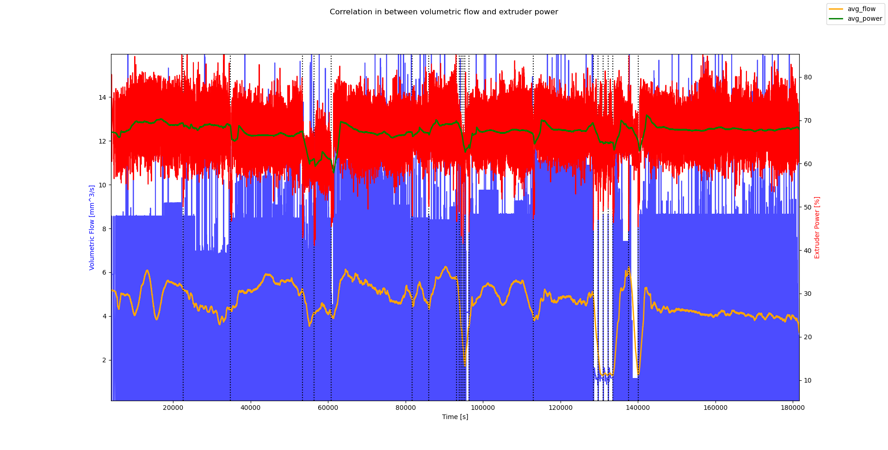

# clog_detection_ml with klipper firmware:

This project is about detecting a clogged nozzle of an fdm printer, by analyzing the PWM heating cycle.
The idea has it's [origin at the klipper forum from TreoWayne.](https://klipper.discourse.group/t/could-one-detect-filament-jams-via-nozzle-heater-duty-cycle/17109/14)
While printing you have a volumetric flow of filament, which gets heated by the hotend. If the nozzle has a clog the actual volumetric flow is 0, since the filament doesn't come out of the nozzle. This means, that the heating element needs less power to hold the temperature, which can be seen when taking a look at the heating cycle. To scientifically back up this thesis i looked at the thermodynamics.

## Thermodynamics:

I looked at the thermodynamics of this and found that the heating power should be depended on the mass flow, which is connected with the volumetric flow. From the first law of thermodynamics with the systems boundaries set outside of the heater block, i got this:

$$
\dot{E} = 0 = \dot{Q_{add}} -\dot{Q_{off}}+ \dot{M}(h_1-h_2)
$$

Where h_1 is the enthalpy of the filament coming in and h_2 out. Q_add comes from the heater and Q_off is the heat which goes in the environment. Assuming the filament is incompressible the enthalpy can be calculated like this:

$$
h_{i} = c_{i}*T_{i}+ v_{i}*p
$$

Where T_1 is the room temperature and T_2 is the nozzle temperature. Pressure p, specific heat capacity c and specific volume v (inverse density).
When we take a look at the formula we can see the that the heater power is depended on the flow. With a clog the flow would be 0. So we could calculate the Mass flow, which we get from the formula and if it is close to 0 for a longer time detect a clog.

$$
\dot{M} = \frac{\dot{Q_{add}}-\dot{Q_{off}}}{h_2-h_1}
$$

I'm not sure if all of these assumptions can be made, since we don't live in an ideal world and in addition we get measurement errors.
I would determine Q_off by heating and holding a temperature for a few minutes, without filament loaded. However there might be a significant difference with a still standing and moving printhead and fan setting.

I originally thought about doing it the analytical way, but i don't think it can work reliable this way. This is why i want to try to train a model with machine learning to recognize a clog.

## Data acquisition:

The machine learning algorithm needs data to be trained. I wrote a script, which logs all of the relevant data, by using the moonraker api. Since i don't want to start the script manually i wrote a shell script, which is activated by the START_PRINT macro, which then calls the python script.
This is the chain of actions:

START_PRINT macro -> shell script -> wrapper_log_script.py -> log_data.py

There needs to be a wrapper script in between, since klipper waits for the script to finish. The script runs locally on my rpi. It's also possible to run the script from a different machine, while being in the same network. When the print is done or aborted it stops automatically. Apart from a csv file with the data theres also a json file generated with the metadata, so you can understand where the data is from.

## Visualization of print data

This is my acquired print data of over 50h. The correlation factor of the mean value is 0.38

## Development status:

I currently wait until i have enough data to start training the machine learning algorithm. When i got the data of prints with a clog, i will label the data by myself, to train the model.

It's still unclear if this method can work reliable and if it's possible to use it for a wide range of printers. There is also a good chance, that if it works for me the same model won't work for you.
